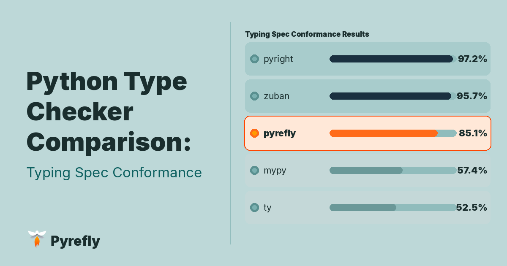

# Python Type Checker Comparison: Typing Spec Conformance

When you write typed Python, you expect your type checker to follow the rules of the language. But how closely do today's type checkers actually follow the Python typing specification?

In this post, we look at what typing spec conformance means, how different type checkers compare, and what the conformance numbers don't tell you.

<!-- truncate -->

## A brief history of the Typing Specification

Python's type system started with [PEP 484](https://peps.python.org/pep-0484/). At the time, the semantics of the type system were mostly defined by the reference implementation, mypy. In practice, whatever mypy implemented became the de-facto specification.

Over time, more type checkers appeared: Pyright (from Microsoft), Pytype (from Google), and Pyre (from Facebook), to name a few. Meanwhile, the type system itself continued to evolve through many different PEPs.

This created a problem: the semantics of the type system were scattered across many documents, and different type checkers implemented slightly different interpretations.
To address this, the typing community began consolidating the rules into a single reference: the [Python typing specification](https://typing.readthedocs.io/en/latest/spec/). The spec describes the semantics of typing features and includes a conformance test suite that type checkers can run to measure how closely they follow the spec.

## The typing conformance test suite

The typing specification includes a [conformance test suite](https://github.com/python/typing/tree/main/conformance) containing roughly a hundred test files. Each file encodes expectations about where a type checker should and shouldn't emit errors. The suite covers a wide range of typing features, from generics to overloads to type aliases.
Within each test, lines are annotated to indicate where an error is expected. When a type checker runs on a file, two types of mismatches can occur:

- **False positives:** The type checker reports an error on a line that is not marked as an error in the test. This means the checker rejected code that the specification considers valid. For example, given this valid code:

    ```python
    class Movie(TypedDict, extra_items=bool):
        name: str
    m: Movie = {"name": "Blade Runner", "novel_adaptation": True}  # OK
    ```

    If the type checker doesn't support `extra_items`, it will flag `"novel_adaptation"` as an unknown key, even though `extra_items=bool` explicitly allows extra boolean-valued keys.

- **False negatives:** The test expects an error, but the type checker does not report one. This means the checker failed to enforce a rule defined in the specification. Using the same `Movie` TypedDict from above:

    ```python
    b: Movie = {"name": "Blade Runner", "year": 1984}  # E: 'int' is not assignable to 'bool'
    ```

    A false negative here means the type checker silently accepts `"year": 1982` even though `extra_items=bool` requires extra values to be `bool`, not `int`.

The [public conformance dashboard](https://github.com/python/typing/blob/main/conformance/results/results.html) aggregates these results across type checkers and shows how many tests each tool passes. The table below summarizes the results as of early March 2026 (commit 62491d5c9cc1dd052c385882e72ed8666bb7fa41):

| Type Checker | Fully Passing | Pass Rate | False Positives | False Negatives |
|---|---|---|---|---|
| pyright | 136/139 | 97.8% | 15 | 4 |
| zuban | 134/139 | 96.4% | 10 | 0 |
| pyrefly | 122/139 | 87.8% | 52 | 21 |
| mypy | 81/139 | 58.3% | 231 | 76 |
| ty | 74/139 | 53.2% | 159 | 211 |

These results probably won’t be up-to-date for long (perhaps not even a week), given that Pyrefly, ty, and Zuban are all currently in beta and being actively developed. Readers in the future should refer to [the latest results](https://github.com/python/typing/blob/main/conformance/results/results.html).

Pyrefly already supports all major type system features, and we expect to close the remaining gaps over the coming months.

## Why conformance matters

Does conformance matter in practice? After all, mypy (the reference implementation & industry standard for Python type checking) only fully passes 57% of test cases.
Practically speaking, the less conformant a type checker is, the more you have to restructure your code to work around its limitations or inconsistencies.
For example, you might follow a pattern recommended by the spec, read documentation that says a particular typing construct should work, and annotate your code accordingly, only to discover that your type checker doesn't correctly implement that part of the specification.

Even if you don’t use any advanced typing features in your own code, you may run into issues when you try to import something from a library that does use those features.
When that happens, you may have to add a redundant `cast`, suppress a spurious error, or restructure your otherwise-working code to make the type checker happy, all because of a gap in conformance.

## What conformance does not measure

While conformance is a valuable benchmark to measure how feature-complete a type checker is, it’s not without limitations.
For one, conformance mismatches are not equally meaningful - some tests check common patterns that appear in regular code, while others check for edge cases that are rarely seen in the wild.

Furthermore, even though the Python type system is becoming increasingly well-specified, many important aspects of type checking are not standardized at all, and therefore not covered by conformance tests. For example:

- **Type Inference**: The typing spec mostly focuses on the semantics of *typed* Python code. When annotations are missing, type checkers have much more freedom in how they infer types and how strictly they check un-annotated code. One common example where type checkers have divergent behavior is [empty container inference](https://pyrefly.org/blog/container-inference-comparison/).

- **Type Refinement/Narrowing**: The process of constraining a variable's type based on runtime checks  is another area where behavior is only partially specified. The spec defines mechanisms like `cast`, `match`, `TypeIs`, and `TypeGuard`, but most real-world narrowing is implicit and relies on patterns that arise from dynamic Python code. These behaviors are implemented on a best-effort basis and support varies widely between tools. We explored several of these patterns in our post on [type narrowing in Pyrefly](https://pyrefly.org/blog/type-narrowing/).

- **Experimental type system features**: Intersection types, negation types, anonymous typed dictionaries, tensor shape types (more on this soon 👀)

## Conclusion

If you're trying to choose a type checker that's right for you, conformance is one useful metric: it tells you how closely a type checker follows the formal typing rules.
But developer experience depends on many other factors, which you should also consider:

- **Inference quality:** How well does it infer types when annotations are missing?
- **Performance:** How fast is it on large codebases?
- **IDE integration:** Does it fully support the language server protocol?
- **Error messages:** Are errors clear and actionable, or cryptic?
- **Third-party package support:** Does it support packages like Django and Pydantic, which require special handling that can't be expressed in type annotations?

In future posts, we'll look at some of these dimensions and compare how different type checkers approach them. In the meantime, you can try [Pyrefly](https://pyrefly.org) yourself, or join the conversation on [Discord](https://discord.gg/BFhMj3bSG3) and [GitHub](https://github.com/facebook/pyrefly).
