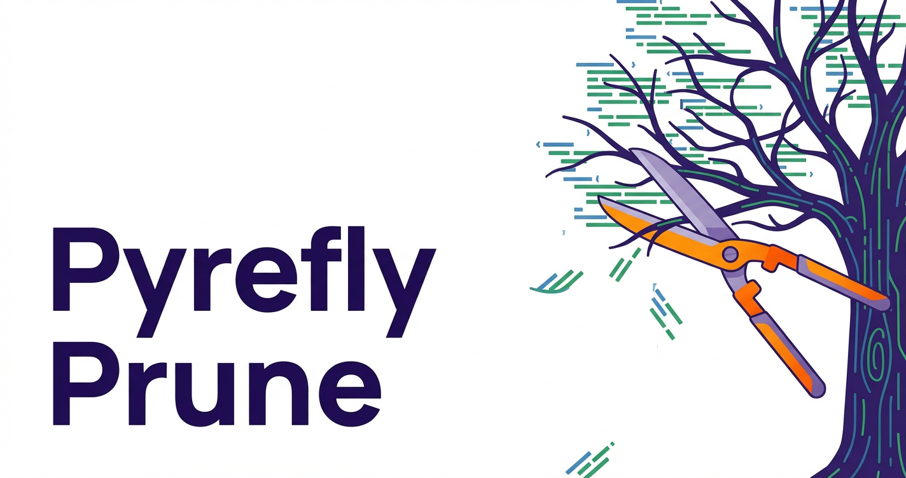

At Pyrefly, we've always believed that type coverage is one of the most important indicators of code quality. Over the past year, we've worked closely with teams across large Python codebases here at Meta - improving performance, tightening soundness, and making type checking a seamless part of everyday development.

But one question kept coming up: *What would it take to reach 100% type coverage?*

Today, we're excited to share a breakthrough.

<!-- truncate -->

## The Problem with "Almost Typed"

Most teams plateau somewhere between 70–95% type coverage. The remaining gap is stubborn:

- Legacy modules with unclear ownership
- Dynamic code paths that resist annotation
- Utility functions that "just work" and nobody wants to touch

Traditional approaches - manual annotation, AI-assisted typing, gradual typing strategies - help, but they all share a common flaw: They assume all code is worth keeping.

## A New Approach: Coverage-First Development

We decided to reverse the problem. Instead of asking *"How do we annotate the remaining code?"*, we asked:

*"What if the remaining code simply didn't exist?"*

Introducing **Pyrefly Prune™**, a new experimental mode that guarantees **100% type coverage** by removing any code that isn't fully typed.

## How It Works

When you run:

```bash
pyrefly check --enforce-total-coverage
```

Pyrefly will:

- Identify any function, class, or module lacking complete type annotations
- Recursively analyze dependencies to ensure soundness
- Safely remove unannotated code paths
- Recompute coverage (now 100%)

The result is a codebase consisting entirely of fully typed, sound, and verifiable Python.

## Early Results

We piloted this approach on several large repositories.

### Case Study: Web Serving Service

- Before:
    - 82% type coverage
    - 1.2M lines of code
- After running Pyrefly Prune™:
    - 100% type coverage
    - 47 lines of code

The remaining code was described by one engineer as: "Incredibly well-typed. Also, it doesn't do anything anymore."

### Case Study: Machine Learning Pipeline

- Before: complex data ingestion, feature engineering, training loops
- After: a single, beautifully annotated function:

```python
def model(x: float) -> float:
   return x
```

Training time improved dramatically.

## Developer Experience Improvements

Surprisingly, developers reported several benefits:

- **Zero type errors** (by construction)
- **Blazing-fast CI** (nothing left to check)
- **Perfect IDE navigation** (all remaining symbols are trivially understood)
- **Reduced cognitive load** ("There's just... less")

One team noted that onboarding time dropped from weeks to seconds.

## Soundness, Perfected

By eliminating all untyped code, Pyrefly Prune™ achieves a new level of soundness:

- No implicit Any
- No missing imports
- No edge cases

In fact, we believe this is the first system to achieve **total program soundness by strategic absence**. We call this approach **Subtractive Soundness™**.

## Advanced Configuration

For teams that want more control, we offer fine-grained pruning strategies:

```toml
[tool.pyrefly.prune]
aggressiveness = "maximal"
preserve_comments = false
preserve_readme = "optional"

# We also support selective retention:
keep_if_funny = true
keep_if_git_blame_is_yours = true
```

## Roadmap

We're actively working on several enhancements:

- **Auto-replacement with TODOs**
  Replace deleted code with thoughtfully written TODO comments that no one will ever complete
- **LLM-assisted hallucinated implementations**
  When code is deleted, generate a plausible replacement that type-checks but may not correspond to reality
- **Executive dashboard metrics**
  Track KPIs like:
    - Lines of code deleted per sprint
    - % of engineers quietly panicking
    - Revenue impact (TBD)


## Frequently Asked Questions

**Q: Does this delete production code?**
A: Yes.

**Q: Is there a rollback mechanism?**
A: We recommend strong git hygiene and emotional resilience.

**Q: What about business logic?**
A: Fully typed business logic is preserved. Untyped business logic was, by definition, suspect.

## Looking Ahead

As AI agents increasingly generate and modify code, we believe the future belongs to systems that can maintain strong guarantees. Sometimes, the best way to ensure correctness... is to remove uncertainty entirely.

And if a small amount of functionality happens to be removed along the way - that's a trade-off we're finally ready to make.

**Pyrefly Prune™** is available today behind the `--enforce-total-coverage` flag. Happy April Fools!
