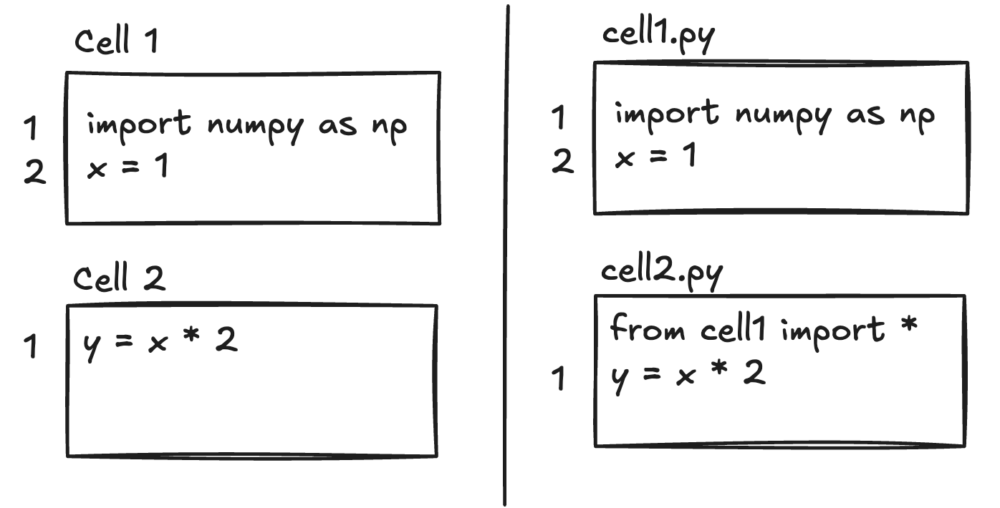

# Supporting Modern IDE features for Jupyter Notebooks

Jupyter notebooks have become an essential tool for Python developers. Their interactive, cell-based workflow makes them ideal for rapid prototyping, data exploration, and scientific computing: areas where you want to tweak a small part of the code and see the updated results inline, without waiting for the whole program to run. Notebooks are the primary way many data scientists and ML engineers write Python, and interactive workflows are highlighted in new data science oriented IDEs like [Positron](https://positron.posit.co/).

But notebooks have historically been second-class citizens when it comes to IDE features. Language servers, which implement the [Language Server Protocol](https://microsoft.github.io/language-server-protocol/) (LSP) to provide features like go-to-definition, hover, and diagnostics across editors, were designed with regular source files in mind. The language server protocol did not include notebook synchronization methods until five years after it was created, and the default Jupyter Notebook experience is missing many of the aforementioned IDE features.

In this post, we'll discuss how language servers have been adapted to work with notebooks, how the LSP spec evolved to support them natively, and how we implemented notebook support in [Pyrefly](https://github.com/facebook/pyrefly).

<!-- truncate -->

## How Language Servers Handled Notebooks Before LSP 3.17

Prior to [LSP 3.17](https://microsoft.github.io/language-server-protocol/specifications/lsp/3.17/specification/#version_3_17_0) (released in 2022), the protocol only supported regular source files. Editors had to write custom adapters to make language servers work with notebooks at all.

The most common approach, used by both [JupyterLab's LSP extension](https://jupyter.org/enhancement-proposals/72-language-server-protocol/language-server-protocol.html) and Meta's internal [Bento notebooks](https://engineering.fb.com/2024/09/17/data-infrastructure/inside-bento-jupyter-notebooks-at-meta/), is a **proxy layer** that intercepts and rewrites all language server requests and responses. The proxy concatenates every cell in the notebook into a single virtual document, and presents that view to the language server. Positions relative to a cell are mapped to positions in the concatenated file before being sent to the server, and positions in responses are mapped back to the corresponding cell before being returned to the editor. From the language server's perspective, it's just analyzing a regular file.

This approach worked, but it pushed all the complexity onto the editor or a middleware layer. Every editor that wanted notebook support had to independently implement cell-stitching and position-mapping logic, but it was language-agnostic and allowed language servers to be used with notebooks at a time when the LSP did not support it directly.

## Notebook Support in LSP 3.17

[LSP 3.17](https://microsoft.github.io/language-server-protocol/specifications/lsp/3.17/specification/#notebookDocument_synchronization) introduced four new operations for notebook documents: `notebookDocument/didOpen`, `notebookDocument/didChange`, `notebookDocument/didSave`, and `notebookDocument/didClose`.

The key difference from regular `textDocument` operations is how content is represented. Instead of sending a single file's worth of text, `notebookDocument/didOpen` sends the contents of each cell as a separate document, with a unique URI assigned to each cell by the editor. `notebookDocument/didChange` encodes information about added and deleted cells, along with content changes within individual cells.

By moving notebook awareness into the protocol itself, the spec lets language servers handle notebook semantics directly rather than relying on each editor to implement its own proxy layer.

## Approaches to Implementation

The LSP spec doesn't prescribe how a language server should represent notebooks internally. If you already have a language server that works on regular files, there are at least two ways to extend it for notebooks:

- **File-based representation:** Build the proxy logic directly into the language server. Concatenate all cell contents into a single virtual "file" and maintain a mapping between each cell and the corresponding lines. The core analysis stays the same, you just convert positions on the way in and on the way out.

- **Cell-based representation:** Treat each cell as a separate "file," with information about cell ordering. Each cell implicitly imports all symbols defined in previous cells. This allows each cell to be analyzed independently.

## How We Did It in Pyrefly

For the initial implementation in Pyrefly, we went with the **file-based approach** because the changes were less invasive. Everything works exactly the same as with regular files; we just map positions between cells and the concatenated source before and after each operation. This is similar to how [jedi-language-server](https://github.com/pappasam/jedi-language-server) and [Ruff](https://github.com/astral-sh/ruff) handle notebooks.

That said, this isn't set in stone and we may revisit the decision in the future. The cell-based approach has some efficiency benefits: if a cell changes, you only need to re-check subsequent cells if the cell's exported types changed; preceding cells wouldn't need to be re-checked at all. With a file-based approach, the language server has to re-check the entire notebook whenever any cell changes. When a client requests diagnostics for a single cell, the server has to retrieve diagnostics for the whole notebook and filter the results to the requested cell.

In practice, this extra work hasn't been a problem for Pyrefly, especially if the data is cached. The average notebook is small compared to the scale Pyrefly is designed to handle.

## What About Alternative Notebook Formats?

The Jupyter `.ipynb` format (a JSON file containing cells, outputs, and metadata) isn't the only notebook format anymore. Projects like [Quarto](https://quarto.org/) use markdown files with embedded code blocks, while [Marimo](https://marimo.io/) stores notebooks as plain Python files where cells are individual functions. These formats are more version-control-friendly and integrate better with standard developer tooling.

Interestingly, these alternative formats face the same fundamental challenge when it comes to IDE features. Under the hood, their editor extensions still need to stitch cells together into a coherent view for the language server, much like the legacy proxy approach we described earlier. The architectural discussion in this post applies just as much to these formats as it does to traditional Jupyter notebooks; whether an editor or a language server handles the cell-to-file mapping, someone has to do it. Furthermore, Python is not the only language that is used in notebooks. Julia and R also benefit from interactive environments since they are used for many of the same tasks as Python. Other notebook environments support SQL, JavaScript, and more. If you have a working language server for a particular language and want to add notebook support, the approaches discussed here may be applied.

## Try It Out

We first shipped built-in notebook support for Pyrefly in v0.41.0, and it's available today in any editor that supports the language server protocol, including: [VS Code](https://marketplace.visualstudio.com/items?itemName=meta.pyrefly), [Positron](https://positron.posit.co/guide-python.html#settings), [JupyterLab](https://pypi.org/project/pyrefly/), and [Marimo](https://marimo.io/).

We'd love for you to try it out and let us know how it goes. If you run into any issues, please [file a bug report](https://github.com/facebook/pyrefly/issues): it helps us a lot, since real-world feedback is the fastest way for us to improve our notebook support.
