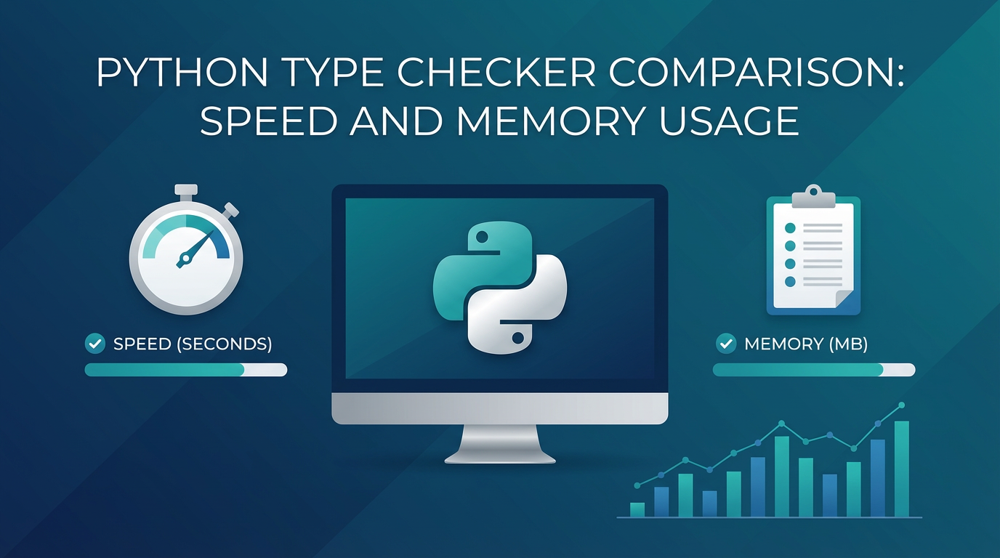

# Python Type Checker Comparison: Speed and Memory Usage



We frequently hear from developers who are excited about the new generation of checkers (Ty and Pyrefly) and want to know how they stack up against each other and the existing, established tools (Mypy and Pyright). In this comparison, we'll focus purely on performance (time to run a full check) and talk a little bit about how design choices, architecture, and features impact that latency.

Evaluating a type checker's performance presents a challenge due to many variables, including diverse evaluation metrics and varying results across different operating systems and hardware configurations. Furthermore, unlike the official test suite for typing specification conformance, there is no universally adopted benchmark for performance used by all type checker maintainers.

Nonetheless, in this blog post, we will attempt to compare speed and memory usage when checking several dozen packages from the command line. We use this performance data to catch regressions in Pyrefly changes that impact OSS packages — we previously only measured type checking performance on internal projects with Pyre1.

Before we start, we'd like to caution that these numbers are only a snapshot at the time of publication and will be out of date quickly. Performance numbers can swing wildly from release to release, because the type checkers are under active development.

<!-- truncate -->

## Why Performance Matters

Fast tooling is an essential part of an efficient developer flow. This is even more important in the age of agentic AI in our IDEs and CLI; they need diagnostics to generate high quality code. The faster, the better.

As codebases grow, the difference compounds. A package like numpy takes Pyright over a minute (70.9s) and over 3 GB of RAM to check on a MacBook M4. Pyrefly checks it in 4.8 seconds with 1 GB of RAM. When you multiply that across dozens of repos in CI, the gap matters.

## The Benchmark

We extended the [Python Package Type Coverage Report](https://python-type-checking.com/) to include a [type checker performance dashboard](https://python-type-checking.com/typecheck_benchmark/) that measures this systematically and shows trends as the new checkers ship regular improvements. Every day, we run the type checkers against the same 53 popular open-source Python packages on GitHub Actions (4 cores, 16 GB of RAM) and record execution time and peak memory usage.

The methodology is straightforward: clone the repo and install dependencies (best effort), run each checker with default settings (with the exception of Mypy, which is run in strict mode to match the other checkers), measure wall-clock time and memory. Each checker gets a 5-minute timeout per package.

The dashboard is useful for automation, trend analysis, and reflects the performance you should expect for your CI-based type checks.

For the sake of this blog and a more accurate reflection of day-to-day programming, we will share the benchmark from a local run on a MacBook M4 with 64 GB of RAM. In our local runs, we check each package 5x with a warmup run beforehand, but we do not cache results between runs (meaning that we don't use Mypy's warm check feature, and all checkers check the whole project from scratch each time).

## The Results

We tested Pyrefly 0.60.0, Ty 0.0.29, Pyright 1.1.408, and Mypy 1.19.1 across 53 popular open-source packages. Here's how the checkers compare head-to-head:

**Small/medium packages** (under 1s for the fastest checker — e.g., flask, requests, sentry-sdk): Pyrefly and Ty both complete in a fraction of a second, typically within 100ms of each other. Pyright and Mypy take 2-20x longer on these same packages.

**Large packages** (1-5s for the fastest checker — e.g., pandas, tensorflow, homeassistant): Pyrefly and Ty remain in the same ballpark, usually finishing within a few seconds of each other. Pyright and Mypy can take 10-50x longer — Pyright needs 144s for pandas, where Pyrefly takes 1.9s and Ty takes 1.5s.

**Extra-large packages** (scipy, numpy, sympy): These stress-test overload resolution and union handling. Both new checkers stay under 5s on most of them, though individual packages can be outliers — Ty takes 30.6s on numpy (likely a bug that will be fixed in a later release), while Pyrefly takes 4.8s; conversely, Ty checks sympy in 1.6s vs. Pyrefly's 4.0s. Pyright can take over two minutes on these packages.

At Meta's scale, Pyrefly checks Instagram's 20 million line codebase in ~30 seconds. The bottom line: both Pyrefly and Ty are an order of magnitude faster than Pyright and Mypy, and they use significantly less memory doing it. Pyrefly uses less memory than Ty on 31 of 53 packages tested, and the gap widens on larger projects.

The variance in performance between checkers can be explained by several reasons:

- **Implementation language** — Mypy is written in Python and Pyright is written in TypeScript, while the two newer checkers are written in Rust, which is a lower-level systems language.
- **Architecture** — Although Pyrefly and Ty are both written in Rust, their architectures are not the same. One of the reasons the Pyrefly team chose not to use Salsa (a Rust caching framework used by Ty) is to have more control over when memory is freed, which may explain the differences in memory usage.
- **Inference** — Features like return type inference (Pyrefly, Pyright) and empty container inference (Pyrefly, Mypy) all have a performance cost when checking un-annotated code. Doing less inference means faster results, but it also means a type checker may not catch as many bugs.
- **Feature completeness** — The set of [supported features](https://pyrefly.org/blog/typing-conformance-comparison/) can impact both performance and memory usage.
- **Maturity/Stability** — By virtue of being less mature and not yet stable, the newer type checkers have more opportunities for optimization, but also have a higher chance of regressions between releases.

## Why Some Packages Take Longer to Check

| Package | Pyright | Pyrefly | Ty | Mypy |
|---------|---------|---------|-----|------|
| scipy | 151.3s | 4.8s | 2.8s | 20.0s |
| pandas | 144.4s | 1.9s | 1.5s | 13.9s |
| numpy | 70.9s | 4.8s | 30.6s | 8.0s |
| sympy | 79.9s | 4.0s | 1.6s | 15.5s |
| tensorflow | 53.7s | 2.4s | 2.0s | 30.6s |
| gradio | 3.9s | 0.3s | 0.3s | 21.3s |
| sqlalchemy | 8.1s | 0.5s | 0.6s | 4.5s |
| prefect | 26.3s | 0.8s | 0.7s | 14.8s |
| sentry-sdk | 3.0s | 0.3s | 0.2s | 17.8s |
| openai | 3.9s | 0.3s | 4.6s | 6.3s |
| flask | 1.2s | 0.2s | 0.2s | 2.0s |
| homeassistant | 51.3s | 2.2s | 2.2s | Crash |

Not all packages are equal from a type checker's perspective. Several factors drive the spread:

- **Codebase size.** Some projects like *yt-dlp* and *transformers* have a lot of code to analyze.
- **Dependency graphs.** Packages like airflow pull in many other packages as dependencies.
- **Unions and overloads.** These language features tend to be expensive to check, so many checkers put a cap on the maximum size of unions to keep performance more predictable.
- **Type coverage.** Not all packages have type annotations or stubs, and the ones that do may not be fully annotated. Packages with low type coverage tend to be slower to check, because inferring types for un-annotated code can be expensive.
- **Configuration.** Disabling certain features like return type inference will typically improve performance at the cost of more precise types. When return type inference is disabled, un-annotated functions will return `Any`.

The biggest spreads we see are on scientific computing packages. Pyright's performance suffers the most here: scipy takes 151 seconds, pandas 144 seconds, and sympy 80 seconds. These packages tend to be the most challenging to type check, containing methods with dozens of overloads and type aliases of large unions. These packages also tend to have un-annotated code, which compounds the problem because type checkers that infer return types (Pyright and Pyrefly) may produce large unions for un-annotated functions.

## Pyrefly Design Choices

There are two important performance questions that should be considered when building a type checker:

- How fast is fast enough?
- Do we prioritize speed over everything else, or are there features we want to include even at a performance cost?

For Pyrefly, "fast enough" means being able to check most projects in seconds, and smaller projects in a fraction of a second. We've largely achieved that goal, checking Instagram's 20 million line codebase in ~30 seconds.

Beyond that, we want to be efficient with memory to support local development workflows, and support advanced inference features to provide greater type safety to users. These priorities are reflected in our design choices:

- By having inference features be on-by-default, we aim to provide greater type safety out of the box. To mitigate the performance costs of that decision, we have guardrails like limiting the width of unions inferred for returns.

In the last few months, we've shipped improvements that have more than doubled Pyrefly's speed and significantly reduced its memory usage. We believe there is still significant room for improvement before Pyrefly reaches its theoretical performance ceiling, and we have a few more tricks up our sleeves to improve performance in coming months.

## Try It Yourself

The benchmark runs on GitHub Actions with standard runners. Your local machine, your codebase, and your configuration will produce different results. Install the new checkers in your project or clone the repository and give the benchmark a try:

```bash
# Clone the repo
git clone https://github.com/facebook/pyrefly.git
cd pyrefly/scripts/benchmark

# Create a venv and install type checkers
python -m venv .venv
source .venv/bin/activate
pip install pyright pyrefly ty mypy

# Run the typecheck benchmark on a few packages
python typecheck_benchmark.py --packages 5

# Run specific packages
python typecheck_benchmark.py --package-names requests flask django

# Or run it on all 53 tracked packages
python typecheck_benchmark.py
```

## Picking the Right Type Checker for Your Project

There are a number of factors to consider when choosing a type checker. The good news is that all of the new Rust-based type checkers are fast, guaranteeing performance for your codebase no matter which one you pick. We've done additional comparisons in previous posts to help look at other features that you might consider when choosing a checker: [conformance to the typing specification](https://pyrefly.org/blog/typing-conformance-comparison/), product choices around [inference](https://pyrefly.org/blog/container-inference-comparison/), [narrowing](https://pyrefly.org/blog/type-narrowing/), and IDE [feature support](https://pyrefly.org/en/docs/IDE-features/). You can also review the [criteria that Positron used](https://positron.posit.co/blog/posts/2026-03-31-python-type-checkers/) when evaluating the Language Server Protocol (LSP) for their IDE, which includes factors like GitHub issue response time and community health, among others.

Whether you are new to type checking or have been here since day one of PEP-484, we hope you can get the benefits of types in your Python. If you try Pyrefly, we would love a ping in Discord or a new issue on GitHub with feedback.

*Source code and methodology at [https://github.com/facebook/pyrefly/blob/main/scripts/benchmark/README.md](https://github.com/facebook/pyrefly/blob/main/scripts/benchmark/README.md). Raw benchmark data for this post is available at [scripts/benchmark/results/2026-04-08-benchmark-macbook-m4.json](https://github.com/facebook/pyrefly/blob/main/scripts/benchmark/results/2026-04-08-benchmark-macbook-m4.json).*
